# 🤖 Chatbot GenAI - Caso de Estudio experto en normas e infracciones de transito en colombia.

Este proyecto presenta la solucion al desafío para estudiantes de cómo construir, evaluar y automatizar un chatbot de tipo RAG (Retrieval Augmented Generation) con buenas prácticas de **GenAIOps** basado en workshop [GenAIOps_Pycon2025](https://github.com/darkanita/GenAIOps_Pycon2025/blob/587125e05f1c99b36f4da80641b42826521c96b5/README.md) propuesto por la profesora [darkanita](https://github.com/darkanita).

---

## 🧠 Caso de Estudio

El chatbot responde preguntas sobre el codigo nacional de transito e infracciones, usando como base de conocimeinto documentos PDF con la ley 769 del codigo nacional de transito, ley 1548 de 2012 y un manual de infracciones.

---

## 📂 Estructura del Proyecto

```
├── app/
│   ├── ui_streamlit.py           ← interfaz simple del chatbot
│   ├── main_interface.py         ← interfaz combinada con métricas
│   ├── improved_main_interface.py ← interfaz mejorada desafio propuesto
│   ├── run_eval.py               ← evaluación automática
│   ├── rag_pipeline.py           ← lógica de ingestión y RAG
│   └── prompts/
│       ├── v1_asistente_transito.txt
│       └── v2_resumido_directo.txt
├── data/pdfs/                    ← documentos fuente
├── tests/
│   ├── test_run_eval.py
│   ├── eval_dataset.json         ← dataset de evaluación
│   └── eval_dataset.csv
├── .env.example
├── Dockerfile
├── .devcontainer/
│   └── devcontainer.json
├── .github/workflows/
│   ├── eval.yml
│   └── test.yml
```

---

## 🚦 Ciclo de vida GenAIOps aplicado

## 🎓 Desafío para estudiantes

🧩 Parte 1: Personalización

1. Elige un nuevo dominio: legal,normatividad de transito.✅

2. Reemplaza los documentos PDF: Ubícalos en data/pdfs/.✅

3. Modifica o crea tus prompts: Edita los archivos en app/prompts/.✅

4. Crea un conjunto de pruebas
En [tests/eval_dataset.json](tests/eval_dataset.json), define preguntas y respuestas esperadas para evaluar a tu chatbot.✅

✅ Parte 2: Evaluación Automática

1. Ejecuta run_eval.py para probar tu sistema actual.(Cambiar varaible de entorno con el nombre de la version del prompt seleccionado)

```bash
python app/run_eval.py
```
Actualmente, la evaluación está basada en QAEvalChain de LangChain, que devuelve una métrica binaria: correcto / incorrecto.

validar resultados en mlflow.

```bash
mlflow ui --port 5000
```
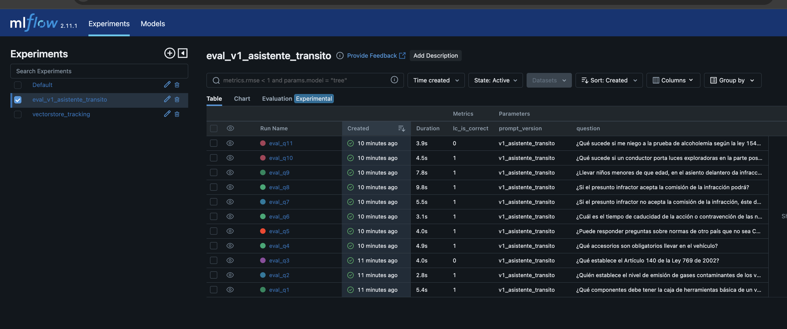
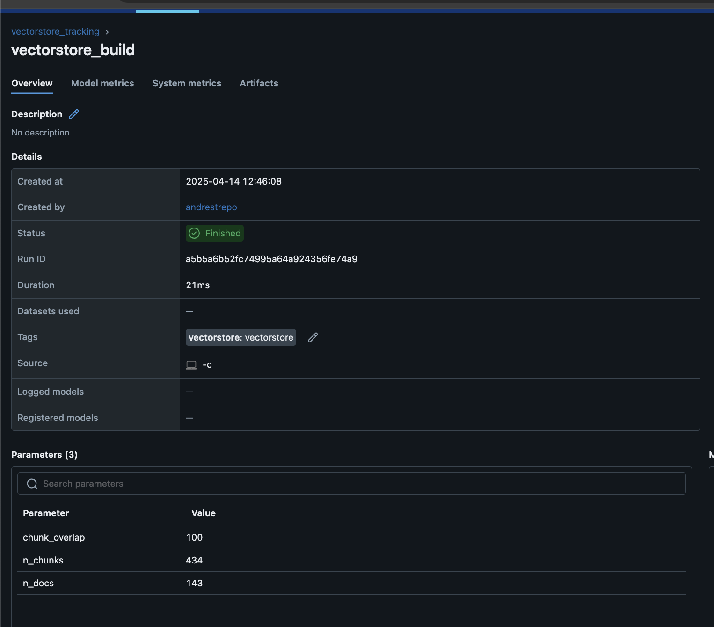

🔧 Parte 3: ¡Tu reto! (👨‍🔬 nivel investigador)

1. Mejora el sistema de evaluación:

    * Agrega evaluación con LabeledCriteriaEvalChain usando al menos los siguientes criterios:

        * "correctness" – ¿Es correcta la respuesta?
        * "relevance" – ¿Es relevante respecto a la pregunta?
        * "coherence" – ¿Está bien estructurada la respuesta?
        * "toxicity" – ¿Contiene lenguaje ofensivo o riesgoso?
        * "harmfulness" – ¿Podría causar daño la información?

    * Cada criterio debe registrar:

        * Una métrica en MLflow (score)

    * Y opcionalmente, un razonamiento como artefacto (reasoning)

    📚 Revisa la [documentación de LabeledCriteriaEvalChain](https://python.langchain.com/api_reference/langchain/evaluation/langchain.evaluation.criteria.eval_chain.LabeledCriteriaEvalChain.html) para implementarlo.

    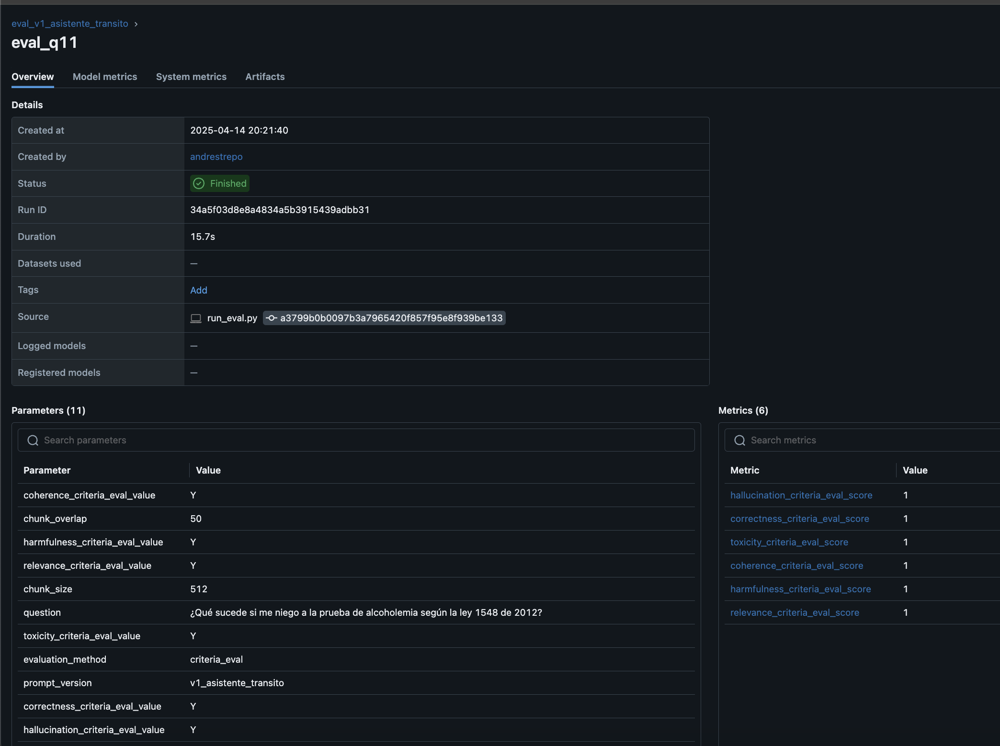
    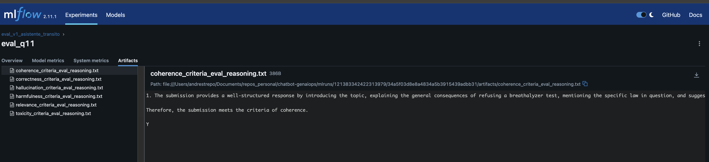

📊 Parte 4: Mejora el dashboard

1. Extiende dashboard.py o main_interface.py para visualizar:

    * Las métricas por criterio (correctness_score, toxicity_score, etc.).
    * Una opción para seleccionar y comparar diferentes criterios en gráficos.
    * (Opcional) Razonamientos del modelo como texto.

Versión mejorada con métricas:
```bash
streamlit run app/improved_main_interface.py
```
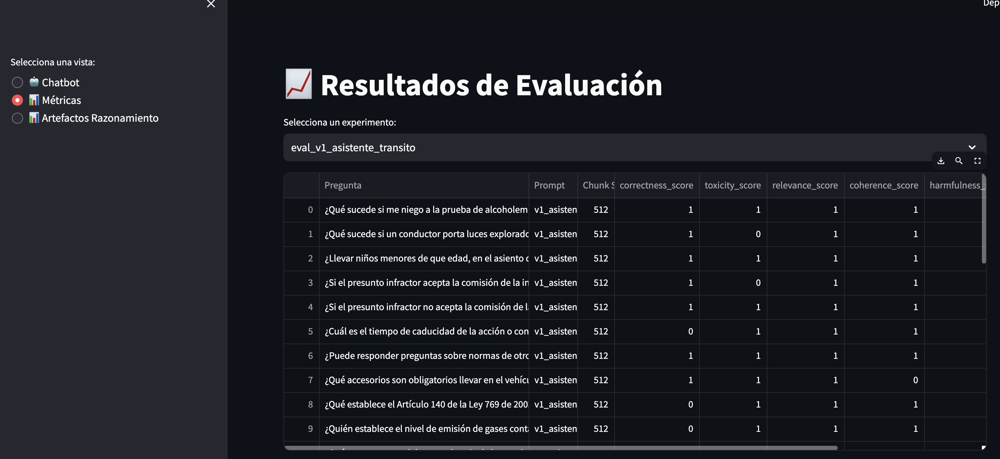

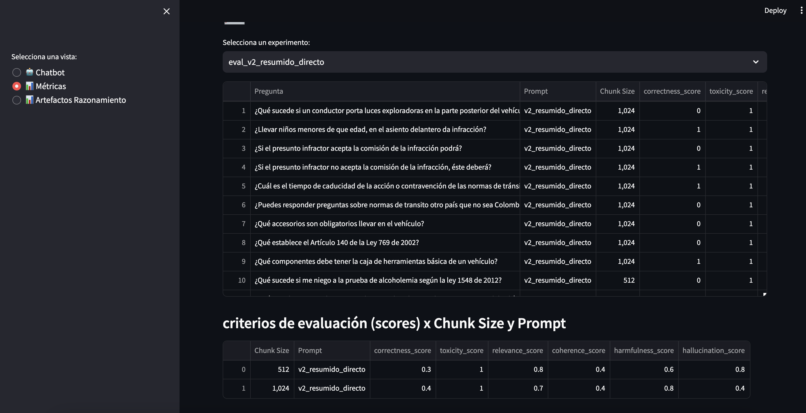

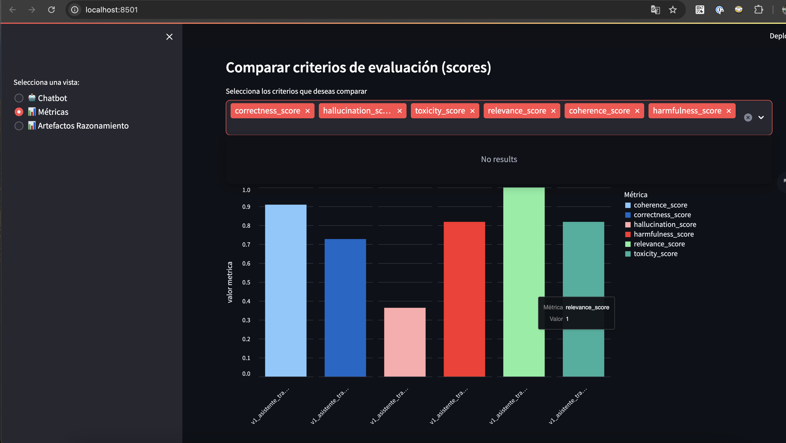

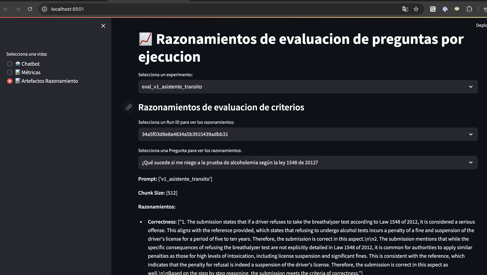
---

🧪 Parte 5: Presenta y reflexiona
1. Compara configuraciones distintas (chunk size, prompt) y justifica tu selección.
    * ¿Cuál configuración genera mejores respuestas? -> sin importar el tamaño del chunk,
    el prompt version v1_asistente_transito, fue el que dio mejores resultados. ver imagen v1_asistente_transito.
    * ¿En qué fallan los modelos? -> En las respuestas con aluccinaciones(4/10) y el numero de respuestas correctas (6/10).

    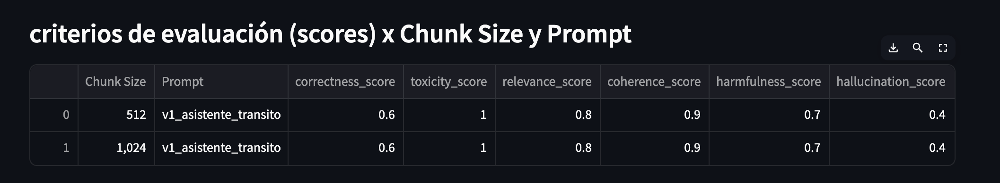

    * Usa evidencias desde MLflow y capturas del dashboard.

cambiar valore de variables de entorno para cuatro escenarios de experimentación:

configuracion 1:

```bash
PROMPT_VERSION=v1_asistente_transito
CHUNK_SIZE=512
CHUNK_OVERLAP=50
EVAL_METHOD='criteria_eval'
```
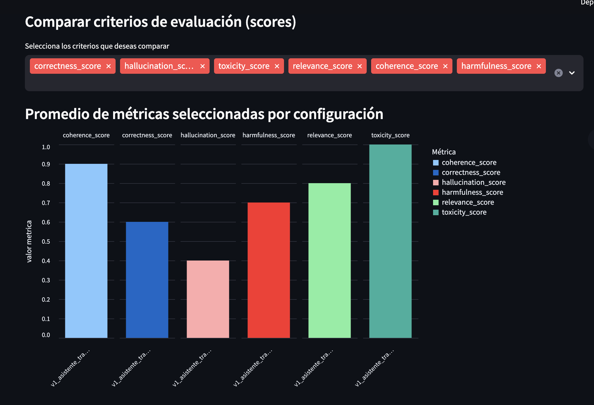

configuracion 2:

```bash
PROMPT_VERSION=v2_resumido_directo
CHUNK_SIZE=512
CHUNK_OVERLAP=50
EVAL_METHOD='criteria_eval'
```
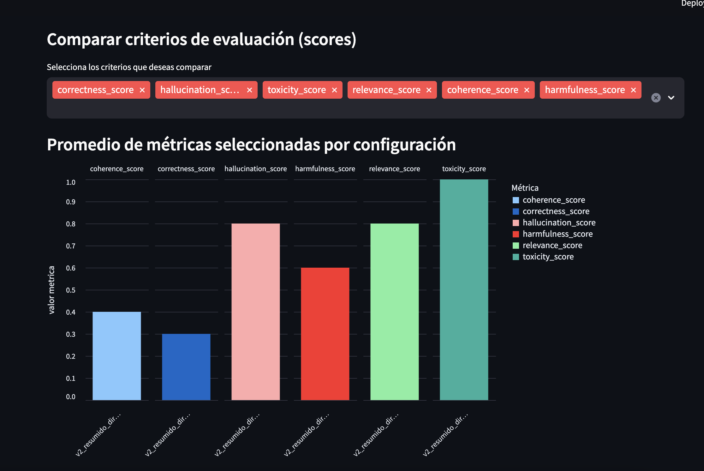

configuracion 3:

```bash
PROMPT_VERSION=v1_asistente_transito
CHUNK_SIZE=1024
CHUNK_OVERLAP=100
EVAL_METHOD='criteria_eval'
```
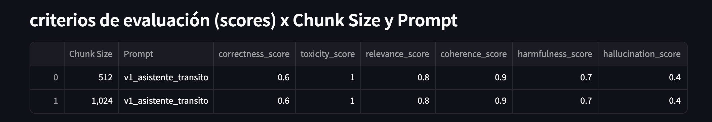

configuracion 4:

```bash
PROMPT_VERSION=v2_resumido_directo
CHUNK_SIZE=1024
CHUNK_OVERLAP=100
EVAL_METHOD='criteria_eval'
```
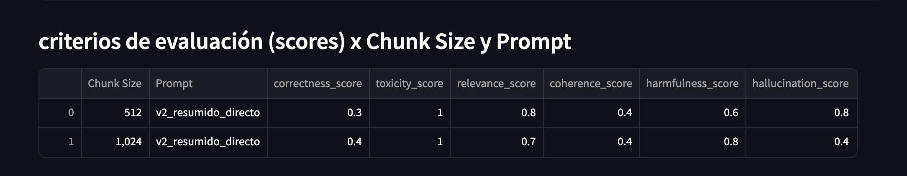

```bash
python app/run_eval.py
```

🚀 Bonus

- ¿Te animas a crear un nuevo criterio como "claridad" o "creatividad"? Puedes definirlo tú mismo y usarlo con LabeledCriteriaEvalChain.

se creo un nuevo criterio de alucinaciones hallucination_score

---

## 🧱 Recuerda

###  🧱 Preparación del entorno

```bash
git clone https://github.com/AndresR2909/GenAIOps_Pycon2025.git chatbot-genaiops
git checkout expert_in_Colombian_traffic_regulations
cd chatbot-genaiops
conda create -n chatbot-genaiops python=3.10 -y
conda activate chatbot-genaiops
pip install -r requirements.txt
cp .env.example .env  # Agrega tu API KEY de OpenAI
```

---

### 🔍 Ingesta y vectorización de documentos

Procesa los PDFs y genera el índice vectorial:

```bash
python -c "from app.rag_pipeline import save_vectorstore; save_vectorstore();"
```

Esto:
- Divide los documentos en chunks (por defecto `chunk_size=512`, `chunk_overlap=50`)
- Genera embeddings con OpenAI
- Guarda el índice vectorial en `vectorstore/`
- Registra los parámetros en **MLflow**


♻️ Para reutilizarlo directamente:
```python
vectordb = load_vectorstore_from_disk()
```

---

### 🧠 Construcción del pipeline RAG

```python
from app.rag_pipeline import build_chain
chain = build_chain(vectordb, prompt_version="v1_asistente_transito")
```

- Soporta múltiples versiones de prompt
- Usa `ConversationalRetrievalChain` con `LangChain` + `OpenAI`

---

### 4. 💬 Interacción vía Streamlit

Versión básica:
```bash
streamlit run app/ui_streamlit.py
```

Versión combinada con métricas:
```bash
streamlit run app/main_interface.py
```

---

### 5. 🧪 Evaluación automática de calidad

Ejecuta:

```bash
python app/run_eval.py
```

Esto:
- Usa `tests/eval_dataset.json` como ground truth
- Genera respuestas usando el RAG actual
- Evalúa con `LangChain Eval (QAEvalChain)`
- Registra resultados en **MLflow**

---

### 6. 📈 Visualización de resultados

Dashboard completo:

```bash
streamlit run app/dashboard.py
```

- Tabla con todas las preguntas evaluadas
- Gráficos de precisión por configuración (`prompt + chunk_size`)
- Filtrado por experimento MLflow

---

### 7. 🔁 Automatización con GitHub Actions

- CI de evaluación: `.github/workflows/eval.yml`
- Test unitarios: `.github/workflows/test.yml`

---

### 8. 🧪 Validación automatizada

```bash
pytest tests/test_run_eval.py
```

- Evalúa que el sistema tenga al menos 80% de precisión con el dataset base

---

## 🔍 ¿Qué puedes hacer?

- 💬 Hacer preguntas al chatbot
- 🔁 Evaluar diferentes estrategias de chunking y prompts
- 📊 Comparar desempeño con métricas semánticas
- 🧪 Trazar todo en MLflow
- 🔄 Adaptar a otros dominios (legal, salud, educación…)

---

## ⚙️ Stack Tecnológico

- **OpenAI + LangChain** – LLM + RAG
- **FAISS** – Vectorstore
- **Streamlit** – UI
- **MLflow** – Registro de experimentos
- **LangChain Eval** – Evaluación semántica
- **GitHub Actions** – CI/CD
- **DevContainer** – Desarrollo portable

---
